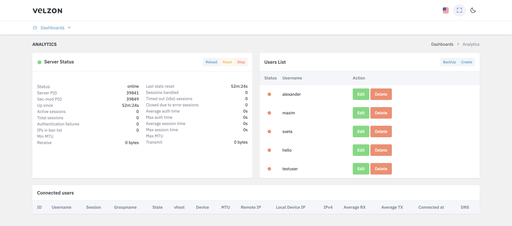

# OpenConnect VPN

OpenConnect VPN is an open source implementation of the Cisco
AnyConnect VPN protocol, which is widely used in enterprises and
universities.

For the best VPN server organization we recommend hosting company [Fofnex.com](https://fornex.com/c/fff118/)


Features:
- Lightweight and fast.
- Works on Linux and most BSD servers.
- Cisco AnyConnect client compatibility
- There is OpenConnect client software for Linux,
  macOS, Windows, and OpenWRT. For Android and iOS, you can use the Cisco
  AnyConnect Client.
- Supports password and certificate authentication
- Supports RADIUS accounting.
- Supports shared hosting (multiple domains).
- Easy to configure
- Resistant to deep packet inspection (DPI). It's based on HTTPS, so it penetrates the firewall very well.
- Penetrates firewalls very well.

Best for: People who need a VPN solution to bypass
national firewalls or to manage a large number of VPN
users, as well as those who don't want to sacrifice speed.

# OpenConnectVPN server installer
The installation script for automatically installing and configuring OpenConnect VPN Server on Ubuntu, as well as for installing the administration panel

To install you need to download the script ocserv-installer.ch
```
git clone https://github.com/LadDev/OpenConnectInstaller.git
```
then you need to enter the folder with the script and give it permission to run

```
cd OpenConnectInstaller
chmod +x ocserv-install.sh
```
and then run the script

```
./ocserv-install.sh
```
After running the script, follow the instructions that will be prompted during the installation

After successful installation the admin panel will be created at http://your_doamein:10034 login and password will be displayed in the installation console. You can also see the login and password in the file
```
api/config.json
```



!!!Attention!!! OpenConnect VPN uses port 443 for connections, if you have other projects running on your server and this port is used, it can disrupt your applications.
Installation on a separate server is recommended

All settings for server installation were taken from the article:
```url
https://www.linuxbabe.com/ubuntu/openconnect-vpn-server-ocserv-ubuntu-20-04-lets-encrypt
```
